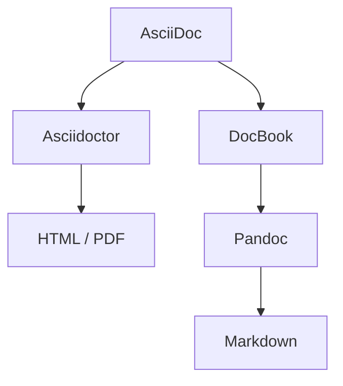

# 📄 Documentation Pipeline


A **single-source documentation pipeline** for generating
**CVs, websites, and architecture documentation** — fully reproducible and CI-ready.

Maintaining a personal profile across multiple platforms is painful and error-prone.

This project solves that by using a **single source of truth**...

## 🧠 What this demonstrates

- Documentation as Code in practice
- Reproducible builds across environments
- Separation of content and presentation
- Automated personal branding pipeline

---

## ✨ Features

* 📚 Generate **HTML, PDF, and Markdown** from AsciiDoc
* 🔁 Multi-step pipeline (Asciidoctor → DocBook → Pandoc)
* 🧩 Modular Gradle build (custom tasks, reusable config)
* 🐳 Fully containerized build environment
* ⚙️ Works locally and in GitHub Actions
* 🎯 Deterministic builds (no “works on my machine”)

---

## 🏗️ Architecture Overview



Additional steps:

* Asset processing (fonts, images, icons)
* Cleanup / housekeeping
* CI/CD deployment

---

## 🚀 Usage

Available tasks:

- buildSite
- buildReadme
- buildCVPersonal
- buildArchitecture

### Local (with container)

```bash
./build.sh <task>
```
### Local (without container)

```bash
./gradlew <task>
```

---

## 📦 Outputs

| Target                     | Output                     |
|----------------------------|----------------------------|
| README                     | `build/readme/README.md`   |
| README                     | `build/readme/README.html` |
| Website                    | `build/site/index.html`    |
| CV (HTML)                  | `build/site/cv.html`       |
| CV (PDF)                   | `build/site/cv/cv.pdf`     |
| Personal PDF               | `build/cv/`                |
| Architecture documentation | `build/architecture/`      |

---

## 🐳 Docker

This project uses the docker image [ghcr.io/dieterbaier/docs-toolbox](https://github.com/dieterbaier/docs-toolbox/pkgs/container/docs-toolbox) to have all necessary tools available.

---

## ⚙️ Requirements (without Docker)

* Java 17+
* Pandoc
* Graphviz

---

## 🔧 Build System

The build is implemented using Gradle:

* Custom tasks (e.g. Pandoc integration)
* Asset pipeline (Copy tasks)
* Cleanup (Delete tasks)
* Environment checks

---

## 📐 Project Structure

```
src-content/
  docs/                 # Architecture documentation
  profile/              # Personal profile sources
    cv/
    readme/
    site/
    theme/
    includes/

build/                  # Destination for the generated target artifacts
```

---

## 🧠 Why this project exists

This project started with a simple problem:

Maintaining a personal profile across multiple platforms is painful and error-prone.

* GitHub personal README
* GitLab personal README
* Personal website
* CV as HTML
* CV as PDF
* Tailored CVs for project applications

All of these share the same core information — but differ in format, level of detail, and audience.

---

### 🎯 Goal

> Maintain **one single source of truth** and generate multiple tailored outputs.

---

### 🧩 Approach

* Write everything in **AsciiDoc**
* Use a **build pipeline** to generate:

    * Website
    * Public CV
    * Private CV (with personal data)
    * README files
* Inject environment-specific data (e.g. contact details; check `.env-example` to get an idea what personal information can be injected via the environment; if you rename `.env-example` to `.env` and insert your personal info, `./build.sh buildCVPersonal` will inject these values into the `build/cv/cv.pdf`) only when needed

---

### 🚀 Result

* No duplication
* No inconsistencies
* Fully automated publishing
* Reproducible builds across environments

---

This project is both:

* a **real-world solution for personal branding**
* and a **technical exploration of documentation as code**


---

## 🛣️ Roadmap

* [ ] Link validation
* [ ] Build verification tests
* [ ] Improved theming
* [ ] Multi-tenant site generation

---

## 🌐 Live

- Website: https://dieterbaier.eu
- Architecture: https://dieterbaier.github.io/profile

---

## 📄 License

This repository is a combination of **open-source code** and **proprietary content**.

### 🧩 Code & Project Structure
Licensed under the MIT License.

You are free to:
- use, modify, and distribute the code
- reuse the project structure and tooling

### 🔒 Content (Important!)
The content in the following directories is **not open source**:

- `src-content`

This includes:
- personal profile information
- architectural documentation
- written texts and descriptions

👉 This content is **proprietary** and may not be reused, modified, or redistributed without explicit permission.

### 📚 Summary

| Part | License                 |
|------|-------------------------|
| Code & build tooling | [MIT](./LICENSE.md)     |
| Project structure | [MIT](./LICENSE.md)     |
| Personal content | [All rights reserved](./CONTENT_LICENSE.md) |

For details see:

- [LICENSE](./LICENSE.md)
- [CONTENT_LICENSE](./CONTENT_LICENSE.md)