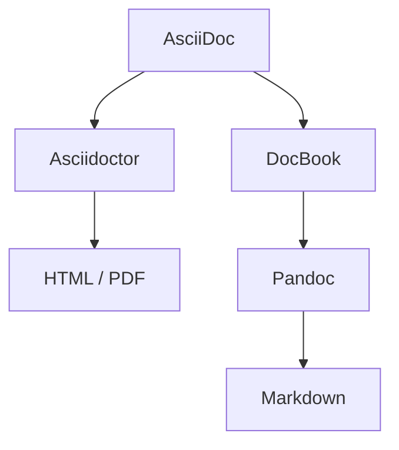

# 📄 Personal Profile of Dieter Baier as running example of a Documentation Pipeline


> 
> 
> Part of the **Docs-as-Code Toolkit**  
> → [https://github.com/docs-as-code-toolkit](https://github.com/docs-as-code-toolkit)

A **single-source documentation pipeline** for generating
**CVs, websites, and architecture documentation** — fully reproducible and CI-ready.

Maintaining a personal profile across multiple platforms is painful and error-prone.

This project solves that by using a **single source of truth**...

## 🧠 What this demonstrates

- Documentation as Code in practice
- Reproducible builds across environments
- Separation of content and presentation
- Automated personal branding pipeline

---

## ✨ Features

* 📚 Generate **HTML, PDF, and Markdown** from AsciiDoc
* 🔁 Multi-step pipeline (Asciidoctor → DocBook → Pandoc)
* 🧩 Modular Gradle build (custom tasks, reusable config)
* 🐳 Fully containerized build environment
* ⚙️ Works locally and in GitHub Actions
* 🎯 Deterministic builds (no “works on my machine”)

---

## 🏗️ Architecture Overview



Additional steps:

* Asset processing (fonts, images, icons)
* Cleanup / housekeeping
* CI/CD deployment

---

## 🚀 Usage

Available tasks:

- buildSite
- buildReadme
- buildCVPersonal
- buildArchitecture


- buildAll (uses the above tasks to build everything at once)

### Local (with container)

```bash
./build.sh <task>
```
### Local (without container)

```bash
./gradlew <task>
```

---

## 📦 Outputs

| Target                     | Output                          |
|----------------------------|---------------------------------|
| README                     | `build/readme/README.md`        |
| README                     | `build/readme/README.html`      |
| Website                    | `build/site/index.html`         |
| CV (on the website, HTML)  | `build/site/cv.html`            |
| CV (on the website, PDF)   | `build/site/cv.pdf`             |
| Personalized CV (PDF)      | `build/cv/cv.pdf`               |
| Architecture documentation | `build/architecture/index.html` |

Additional needed artifacts are copied during the build process to the according directories.

---

## 🐳 Docker

This project uses the docker image [ghcr.io/docs-as-code-toolkit/docs-toolbox](https://github.com/docs-as-code-toolkit/docs-toolbox/pkgs/container/docs-toolbox) to have all necessary tools available.

---

## ⚙️ Requirements (without Docker)

* Java 17+ (because the build uses gradle and the [asciidoctor gradle plugin](https://asciidoctor.org/docs/asciidoctor-gradle-plugin/))
* Pandoc (to generate markdown from asciidoc)
* Graphviz (for generating graphics)

---

## 🔧 Build System

The build is implemented using Gradle:

* Custom tasks (e.g. Pandoc integration)
* Asset pipeline (Copy tasks)
* Cleanup (Delete tasks)
* Environment checks

### 🏗️ CI/CD Pipeline

The CI/CD Pipeline is implemented as GitHub Actions. It uses the same docker image and gradle tasks as you would use locally.

For deploying the site, it is using SFTP.

To enable the pipeline to use personal information (which is included in the documentation or required during deployment), the following secrets and variables must be defined:

    secrets.SITE_EMAIL                # for personal information injected to the content
    secrets.SITE_ADDRESS_NAME
    secrets.SITE_STREET
    secrets.SITE_PLZ
    secrets.SITE_CITY
    secrets.SITE_TEL

    secrets.GITLAB_TOKEN              # To be able to deploy the README.md files
    secrets.PROFILE_REPO_TOKEN

    secrets.SFTP_PASSWORD             # To deploy the website and architcture documentation to the personal webspace
    vars.SFTP_REMOTE_BASE
    vars.SFTP_HOST
    vars.SFTP_PORT
    vars.SFTP_USER

The pipeline builds and deployes

- README.md to https://github.com/dieterbaier (has to be improved so it is not fixed)
- README.md to https://gitlab.com/brdietdidi (has to be improved so it is not fixed)
- The profile website (including the cv.pdf, which can be downloaded from the website) to `<vars.SFTP_REMOTE_BASE>/site`
- The architecture documentation to `<vars.SFTP_REMOTE_BASE>/architecture`

---

## 📐 Project Structure

```
.github/
  workflows/
    update-profile.yml  # The CI/CD github action description
src-content/
  docs/ 
    arc42/              # Architecture documentation
  profile/              # Personal profile sources
    cv/
    readme/
    site/
    includes/
  theme/                # The theme for the docs and the profile

build/                  # Destination for the generated target artifacts
.env-example            # A file that defines the environment variables needed to populate personal information in the documentation. If this file exists as a .env file containing custom values, those values will be used during the build (locally). Of course, the .env file must not be checked in.
```

---

## 🧠 Why this project exists

This project started with a simple problem:

Maintaining a personal profile across multiple platforms is painful and error-prone.

* GitHub personal README
* GitLab personal README
* Personal website
* CV as HTML
* CV as PDF
* Tailored CVs for project applications

All of these share the same core information — but differ in format, level of detail, and audience.

---

### 🎯 Goal

> Maintain **one single source of truth** and generate multiple tailored outputs.

---

### 🧩 Approach

* Write everything in **AsciiDoc**
* Use a **build pipeline** to generate:

    * Website
    * Public CV
    * Private CV (with personal data)
    * README files
* Inject environment-specific data (e.g. contact details; check `.env-example` to get an idea what personal information can be injected via the environment; if you rename `.env-example` to `.env` and insert your personal info, `./build.sh buildCVPersonal` will inject these values into the `build/cv/cv.pdf`) only when needed

---

### 🚀 Result

* No duplication
* No inconsistencies
* Fully automated publishing
* Reproducible builds across environments

---

This project is both:

* a **real-world solution for personal branding**
* and a **technical exploration of documentation as code**


---

## 🛣️ Roadmap

* [ ] Link validation
* [ ] Build verification tests
* [ ] Multi-tenant site generation

---

## 🌐 Live

- Website: https://dieterbaier.eu
- Architecture: https://architecture.dieterbaier.eu

---

## 📄 License

This repository is a combination of **open-source code** and **proprietary content**.

### 🧩 Code & Project Structure
Licensed under the MIT License.

You are free to:
- use, modify, and distribute the code
- reuse the project structure and tooling

### 🔒 Content (Important!)
The content in the following directories is **not open source**:

- `src-content`

This includes:
- personal profile information
- architectural documentation
- written texts and descriptions

👉 This content is **proprietary** and may not be reused, modified, or redistributed without explicit permission.

### 📚 Summary

| Part | License                 |
|------|-------------------------|
| Code & build tooling | [MIT](./LICENSE.md)     |
| Project structure | [MIT](./LICENSE.md)     |
| Personal content | [All rights reserved](./CONTENT_LICENSE.md) |

For details see:

- [LICENSE](./LICENSE.md)
- [CONTENT_LICENSE](./CONTENT_LICENSE.md)
