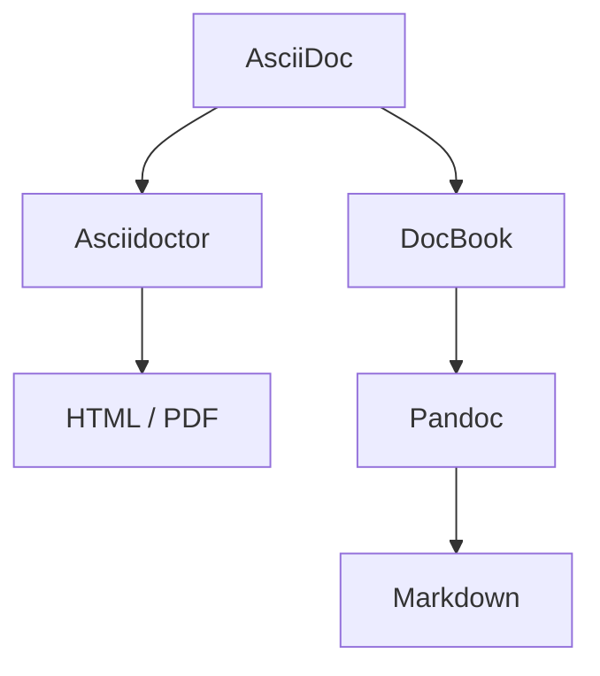

# 📄 Personal Profile of Dieter Baier as running example of a Documentation Pipeline


> 
> 
> Part of the **Docs-as-Code Toolkit**  
> → [https://github.com/docs-as-code-toolkit](https://github.com/docs-as-code-toolkit)

A **single-source documentation pipeline** for generating
**CVs, websites, and architecture documentation** — fully reproducible and CI-ready.

Maintaining a personal profile across multiple platforms is painful and error-prone.

This project solves that by using a **single source of truth**...
It now treats both the architecture documentation and the profile content as
validated Docs-as-Code knowledge artifacts.

As a running example of the Docs-as-Code Toolkit, this project shows both
layers in practice: structured source knowledge and metadata are maintained one
layer above publishing, while `docs-toolbox` provides the reproducible runtime
that renders the derived website, README, CV, article, and architecture
outputs. Tools such as [docToolchain](https://github.com/docToolchain) could be
combined with the same source approach when a project needs a different
publishing workflow.

## 🧠 What this demonstrates

- Documentation as Code in practice
- Reproducible builds across environments
- Separation of content and presentation
- Automated personal branding pipeline
- Architecture knowledge managed above the publishing layer

---

## ✨ Features

* 📚 Generate **HTML, PDF, and Markdown** from AsciiDoc
* 🔁 Multi-step pipeline (Asciidoctor → DocBook → Pandoc)
* 🧩 Modular Gradle build (custom tasks, reusable config)
* 🐳 Fully containerized build environment
* ⚙️ Works locally and in GitHub Actions
* 🎯 Deterministic builds (no “works on my machine”)
* 🧭 architecture-knowledge-toolkit style architecture metadata, ADRs, quality scenarios, risks, validation, and generated traceability
* 🪪 Profile artifact metadata for articles, shorts, CV, README, profile pages, and project entries

---

## 🏗️ Architecture Overview


```mermaid
graph TD
  A[AsciiDoc] --> B[Asciidoctor]
  B --> C[HTML / PDF]
  A --> D[DocBook]
  D --> E[Pandoc]
  E --> F[Markdown]
```

Additional steps:

* Asset processing (fonts, images, icons)
* Cleanup / housekeeping
* CI/CD deployment

---

## 🔒 Private-to-public article lifecycle

An article should be able to be written, reviewed, and published without
becoming public merely by existing in a repository. Drafts therefore live in a
second, private repository —
[`dieterbaier/profile-private`](https://github.com/dieterbaier/profile-private),
which is not publicly reachable — and move here when they are ready to be seen.

```
profile-private            profile (this repository)
  drafts, notes    ──────▶   preview  ──────▶  published
  status: private            status: preview   status: published
```

* **This repository owns the tooling.** Build, validators, generators, schemas,
  and theme live here. The private repository holds content only and reaches
  them through a sibling checkout; its build stops if it ever grows a copy of
  its own.
* **Targets are selected by metadata, not by location.** The public site renders
  `status: published` and nothing else, and fails rather than skips when it
  cannot name a source it must exclude.
* **Promotion is a move, not a copy**, so an article has one authoritative
  source. Because two repositories cannot be written in one transaction, it is a
  saga with a leading side and a defined recovery for every point it can stop at.

The decisions are ADR-008 (the lifecycle), ADR-009 (private repository
integration), ADR-011 (preview visibility without authentication), and ADR-012
(what the private target renders), all in
[the architecture documentation](https://architecture.dieterbaier.eu). Most of
the workflow is decided and documented; what is built is recorded per rule in
each record's implementation status, rather than implied by the diagram above.

To render the private drafts locally, check the two repositories out as siblings
and run `./gradlew buildSitePrivate` (or `./build.sh buildSitePrivate`) here. The
target lands in `build/site-private`, carries `noindex` on every page, and is
deployed by nothing.

---

## 🚀 Usage

Available tasks:

- buildSite
- buildReadme
- buildArticlesMarkdown
- buildCVPersonal
- buildArchitecture
- validateArchitectureMetamodel
- generateArchitectureArtifacts
- validateProfileMetamodel
- generateProfileArtifacts
- buildAgentAdapters (regenerates the thin agent adapters from `skills/**/SKILL.md`)
- checkAgentAdapters (fails if the generated agent adapters are stale)
- testAgentAdapters (runs the adapter generator behaviour tests)


- buildAll (builds the main profile outputs at once)

### Local (with container)

```bash
./build.sh <task>
```
### Local (without container)

```bash
./gradlew <task>
```

---

## 📦 Outputs

| Target                     | Output                          |
|----------------------------|---------------------------------|
| README                     | `build/readme/README.md`        |
| README                     | `build/readme/README.html`      |
| Articles (Markdown)        | `build/articles/**/*.md`        |
| Article media              | `build/articles/media/**`       |
| Website                    | `build/site/index.html`         |
| CV (on the website, HTML)  | `build/site/cv.html`            |
| CV (on the website, PDF)   | `build/site/cv.pdf`             |
| Personalized CV (PDF)      | `build/cv/cv.pdf`               |
| Architecture documentation | `build/architecture/index.html` |
| Profile artifact index     | `src-content/profile/generated/profile-artifact-index.adoc` |
| Architecture traceability  | `src-content/docs/arc42/generated/traceability-matrix.adoc` |

Additional needed artifacts are copied during the build process to the according directories.

---

## 🐳 Docker

This project uses the docker image [ghcr.io/docs-as-code-toolkit/docs-toolbox](https://github.com/docs-as-code-toolkit/docs-toolbox/pkgs/container/docs-toolbox) to have all necessary tools available.

---

## ⚙️ Requirements (without Docker)

* Java 17+ (because the build uses gradle and the [asciidoctor gradle plugin](https://asciidoctor.org/docs/asciidoctor-gradle-plugin/))
* Pandoc (to generate markdown from asciidoc)
* Graphviz (for generating graphics)

---

## 🔧 Build System

The build is implemented using Gradle:

* Custom tasks (e.g. Pandoc integration)
* Directory-based Pandoc conversion for article Markdown exports
* Architecture metamodel validation and generation from `scripts/validate-metamodel.rb`
* Profile artifact validation and index generation from `scripts/validate-profile-metamodel.rb`
* Asset pipeline (Copy tasks)
* Cleanup (Delete tasks)
* Environment checks

Generated fragments live under `**/generated/` and are reproducible build
output. They are not primary editing surfaces.

The one exception is the standalone article listing pages under
`src-content/profile/site/**/articles/lists/`: they are generated where they are
published, so the ordinary site build renders them. They are ignored by Git and
regenerated by `generateProfileArtifacts` like every other generated file.

---

## 🤖 AI Workflows

Project-local AI instructions start in `AGENTS.md` and then fan out into
AI-agnostic contracts, generic skills, reusable templates, and adapter-specific
metadata.

The baseline project contract is `general-semantic-contracts.md`.

Repeatable AI-assisted work is described with contracts under `ai-contracts/`.
The relevant contracts are:

- `article-summary-pack`: HTML summaries for LinkedIn and Substack
- `write-article`: article drafts and metadata using the repository article template
- `profile-artifact-metadata`: metadata for profile pages, CV content, articles, shorts, project entries, and generated profile indexes

Generic skills live in `skills/`:

- `article-summary-pack`
- `write-article`
- `profile-artifact-maintenance`

Codex-specific metadata lives under `adapters/codex/`. Codex should read
`adapters/codex/README.md` after `AGENTS.md`, `general-semantic-contracts.md`,
and the relevant generic skill.

### 🏗️ CI/CD Pipeline

The CI/CD Pipeline is implemented as GitHub Actions. It uses the same docker image and gradle tasks as you would use locally.

For deploying the site, it is using SFTP.

To enable the pipeline to use personal information (which is included in the documentation or required during deployment), the following secrets and variables must be defined:

    secrets.SITE_EMAIL                # for personal information injected to the content
    secrets.SITE_ADDRESS_NAME
    secrets.SITE_STREET
    secrets.SITE_PLZ
    secrets.SITE_CITY
    secrets.SITE_TEL

    secrets.GITLAB_TOKEN              # To be able to deploy the README.md files
    secrets.PROFILE_REPO_TOKEN

    secrets.SFTP_PASSWORD             # To deploy the website and architecture documentation to the personal webspace
    vars.SFTP_REMOTE_BASE
    vars.SFTP_HOST
    vars.SFTP_PORT
    vars.SFTP_USER
    vars.SITE_BASE_URL                # public HTTPS base URL used to derive canonical links

Credential ownership:

| Name | GitHub Actions scope | Purpose | Required access |
| --- | --- | --- | --- |
| `PROFILE_REPO_TOKEN` | repository secret in `dieterbaier/profile` | Checkout and push the generated README to `dieterbaier/dieterbaier` | Fine-grained GitHub token for `dieterbaier/dieterbaier` with `Contents: Read and write` |
| `GITLAB_TOKEN` | repository secret in `dieterbaier/profile` | Clone and push the generated README to `gitlab.com/brdietdidi/brdietdidi` | GitLab token with repository write access |
| `SFTP_PASSWORD` | `production` environment secret in `dieterbaier/profile` | Upload site and architecture artifacts to the private webspace | SFTP password for the configured deployment user |
| `SITE_*` secrets | `production` environment secrets in `dieterbaier/profile` | Inject private contact data during site/CV generation | Values only, no repository access |
| `SFTP_*` variables | `production` environment variables in `dieterbaier/profile` | Configure SFTP target host, port, user, and remote base path | Non-secret deployment configuration |
| `SITE_BASE_URL` | `production` environment variable in `dieterbaier/profile` | Derive canonical URLs for generated public HTML pages | Non-secret public HTTPS URL; the production build fails when it is missing or invalid |

Token rotation:

1. Create a new fine-grained GitHub personal access token for the target repository `dieterbaier/dieterbaier`.
2. Grant `Contents: Read and write`. Do not grant broader account permissions unless the workflow needs them later.
3. Update the repository secret `PROFILE_REPO_TOKEN` in `dieterbaier/profile`.
4. Re-run the failed `Build Docs` workflow or trigger it with `workflow_dispatch`.

If the README deploy fails in the `checkout github profile repo` step with `Bad credentials`, rotate `PROFILE_REPO_TOKEN`. If the GitLab README step fails during clone or push, rotate `GITLAB_TOKEN`. If the private webspace upload fails during `lftp`, check `SFTP_PASSWORD` and the `SFTP_*` variables.

The pipeline builds and deploys

- README.md to https://github.com/dieterbaier (has to be improved so it is not fixed)
- README.md to https://gitlab.com/brdietdidi (has to be improved so it is not fixed)
- The profile website (including the cv.pdf, which can be downloaded from the website) to `<vars.SFTP_REMOTE_BASE>/site`
- The architecture documentation to `<vars.SFTP_REMOTE_BASE>/architecture`

Each deployment target has its own GitHub Actions job. This allows a failed target deployment to be re-run without deploying already successful targets again.

When article sources change, the pipeline also builds Markdown exports under `build/articles` as part of the uploaded build artifact.

---

## 📐 Project Structure

```
.github/
  workflows/
    update-profile.yml  # The CI/CD github action description
src-content/
  docs/ 
    arc42/              # Toolkit-style arc42 architecture documentation
    canvas/             # Product and architecture canvases
    doc-*.adoc          # Product-level source documents
  profile/              # Personal profile sources
    cv/
    readme/
    site/
      articles/         # Website articles and Markdown export sources
    includes/
    generated/          # Generated profile artifact index
  theme/                # The theme for the docs and the profile
metamodel/              # Architecture and profile metadata schemas
scripts/                # Validators and generators
templates/              # ADR, quality scenario, risk, and publication templates
ai-contracts/           # AI-agnostic task contracts
skills/                 # AI-agnostic reusable skills
adapters/               # Agent-specific integration, e.g. Codex metadata
general-semantic-contracts.md

build/                  # Destination for the generated target artifacts
.env-example            # A file that defines the environment variables needed to populate personal information in the documentation. If this file exists as a .env file containing custom values, those values will be used during the build (locally). Of course, the .env file must not be checked in.
```

---

## 🧠 Why this project exists

This project started with a simple problem:

Maintaining a personal profile across multiple platforms is painful and error-prone.

* GitHub personal README
* GitLab personal README
* Personal website
* CV as HTML
* CV as PDF
* Tailored CVs for project applications

All of these share the same core information — but differ in format, level of detail, and audience.

---

### 🎯 Goal

> Maintain **one single source of truth** and generate multiple tailored outputs.

---

### 🧩 Approach

* Write everything in **AsciiDoc**
* Use a **build pipeline** to generate:

    * Website
    * Public CV
    * Private CV (with personal data)
    * README files
    * Article Markdown exports
* Inject environment-specific data (e.g. contact details; check `.env-example` to get an idea what personal information can be injected via the environment; if you rename `.env-example` to `.env` and insert your personal info, `./build.sh buildCVPersonal` will inject these values into the `build/cv/cv.pdf`) only when needed

---

### 🚀 Result

* No duplication
* No inconsistencies
* Fully automated publishing
* Reproducible builds across environments

---

This project is both:

* a **real-world solution for personal branding**
* and a **technical exploration of documentation as code**


---

## 🛣️ Roadmap

* [ ] Link validation
* [ ] Build verification tests
* [ ] Multi-tenant site generation

---

## 🌐 Live

- Website: https://dieterbaier.eu
- Architecture: https://architecture.dieterbaier.eu

---

## 📄 License

This repository is a combination of **open-source code** and **proprietary content**.

### 🧩 Code & Project Structure
Licensed under the MIT License.

You are free to:
- use, modify, and distribute the code
- reuse the project structure and tooling

### 🔒 Content (Important!)
The content in the following directories is **not open source**:

- `src-content`

This includes:
- personal profile information
- architectural documentation
- written texts and descriptions

👉 This content is **proprietary** and may not be reused, modified, or redistributed without explicit permission.

### 📚 Summary

| Part | License                 |
|------|-------------------------|
| Code & build tooling | [MIT](./LICENSE.md)     |
| Project structure | [MIT](./LICENSE.md)     |
| Personal content | [All rights reserved](./CONTENT_LICENSE.md) |

For details see:

- [LICENSE](./LICENSE.md)
- [CONTENT_LICENSE](./CONTENT_LICENSE.md)
